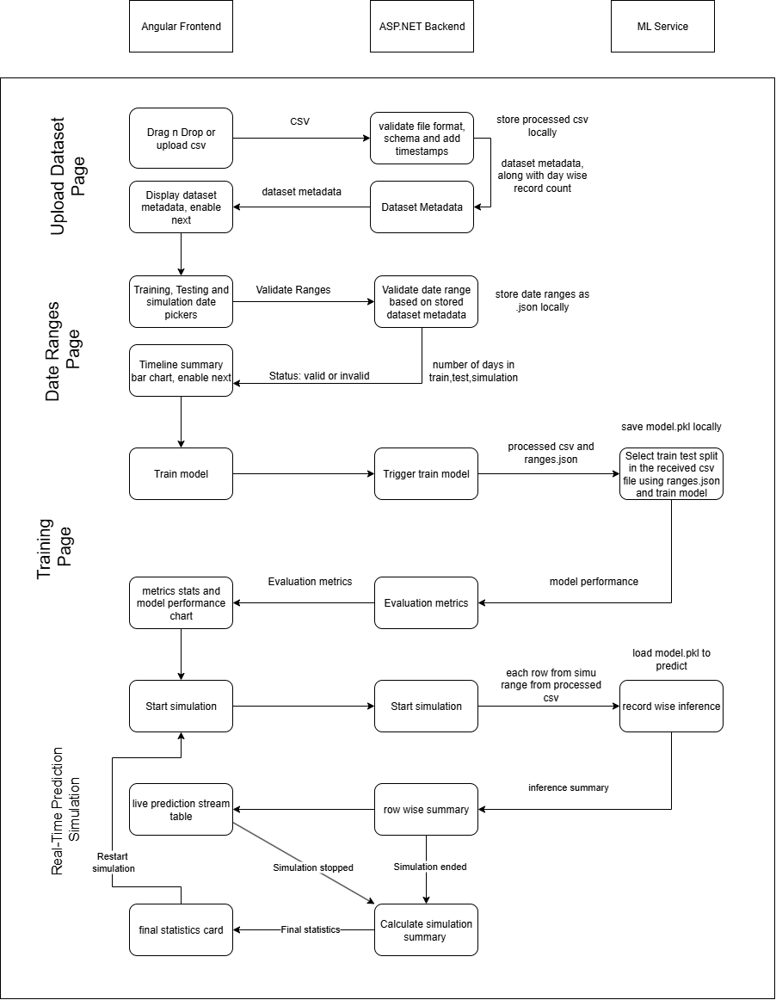

# IntelliInspect

## Data Flow Diagram




## API Contract

### Upload CSV Endpoint

**URL**: `/api/Dataset/upload`  
**Method**: `POST`  
**Content-Type**: `multipart/form-data`  
**Description**: Uploads a pre-processed CSV file for analysis.

---

#### Request

```http
POST /upload-csv
Content-Type: multipart/form-data
```
#### Response

```json
{
  "filename": "processed_data.csv",
  "total_records": 14704,
  "total_columns": 5,
  "pass_rate": "70%",
  "date_range": "2021-01-01 to 2021-12-31"
}
```

### Select Date Range Endpoint

**URL**: `/api/Dataset/validate-date-ranges`  
**Method**: `POST`  
**Content-Type**: `application/json`  
**Description**: Submits the selected date range to filter the dataset for training and simulation.

---

#### Request

```json
{
  "trainStart": "string",
  "trainEnd": "string",
  "testStart": "string",
  "testEnd": "string",
  "simStart": "string",
  "simEnd": "string"
}
```
#### Respopnse

```json
{
  "status": "Valid",
  "training": {
    "count": 8000,
    "range": "2021-01-01 to 2021-06-30"
  },
  "testing": {
    "count": 4000,
    "range": "2021-07-01 to 2021-09-30"
  },
  "simulation": {
    "count": 2704,
    "range": "2021-10-01 to 2021-12-31"
  },
  "overall": {
    "earliest": "2021-01-01",
    "latest": "2021-12-31"
  }
}
```
### Train Model

**URL**: `/api/Model/traom`  
**Method**: `GET`  
**Content-Type**: `application/json`  
**Description**: Starts training of the model.

---

#### Request

_No request body required._  


#### Response

```json
{
  "status": "Model trained successfully",
  "accuracy": 0.6237268518518518,
  "precision": 0.008164550642487922,
  "recall": 0.5398679532757745,
  "f1_score": 0.016085831454383123
}
```
### Simulation

**URL**: `/start-simulation`  
**Method**: `GET`  
**Content-Type**: `application/json`  
**Description**: Starts simulation.

#### Request

_No request body required._  

#### Response

```json
[
  {
    "timestamp": "2021-01-01T00:00:00Z",
    "id": 1,
    "prediction": 0,
    "confidence": 0.87,
    "temperature": 21.5,
    "pressure": 101.2,
    "humidity": 40.8
  },
  {
    "timestamp": "2021-01-01T00:00:01Z",
    "id": 2,
    "prediction": 1,
    "confidence": 0.65,
    "temperature": 21.6,
    "pressure": 101.3,
    "humidity": 40.9
  }
]
```